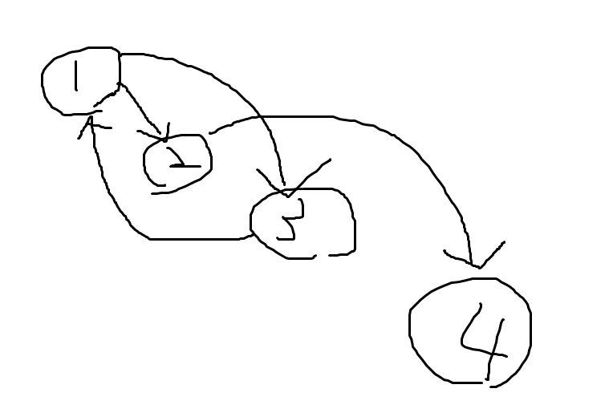

# Floyd-Warshall-bitset-speedup
Use bitset for Floyd-Warshall to handle the transitive closure problem.

# Problem Description
## Input
Give a n*n matrix, representing the n nodes of a graph and the connection relationship between each node. (see example below)
## Output
n*n matrix A, A[i][j] indicates whether i can reach j through the given edge of the input.

e.g. 

input: &emsp;&emsp;&ensp; output:

4 <br>
1 1 1 0 &emsp;&emsp; 1 1 1 1 <br>
0 1 0 1 &emsp;&emsp; 0 1 0 1 <br>
1 0 1 0 &emsp;&emsp; 1 1 1 1 <br>
0 0 0 1 &emsp;&emsp; 0 0 0 1 

which means: <br>
(Output explanation: 1->2->4 | 3->1->2 | 3->1->2->4)<br>
  

# Solution - Floyd-Warshall algorithm (DP)

```c++
for (k = 0; k < n; ++k)
    for (i = 0; i < n; ++i)
        for (j = 0; j < n; ++j)
            //If i -> k exist and k -> j exist, than i can reach j by i -> j -> k.
            if(A[i][k] && A[k][j]) A[i][j] = 1;
//time complexity O(n^3)
```
# Optimization
1. Observe the part that is computed in the first loop:<br>
  k = 0 &emsp;&emsp;&ensp; k = 1 &emsp;&emsp;&ensp; k = 2 &emsp;&emsp;&ensp; and so on...<br> 
  1 1 1 0&emsp;&emsp;      ~1~ 1 ~1 0~ &emsp;&emsp; ~1 1~ 1 ~1~<br>
  0 ~1 0 1~&emsp;&emsp;    0 1 0 1     &emsp;&emsp; ~0 1~ 0 ~1~<br>
  1 ~0 1 0~&emsp;&emsp;    ~1~ 1 ~1 0~ &emsp;&emsp; 1 1 1 1<br>
  0 ~0 0 1~&emsp;&emsp;    ~0~ 0 ~0 1~ &emsp;&emsp; ~0 0~ 0 ~1~

2. Treat each row as a string of bits:<br>
  k0 &emsp;&emsp; k1 <br>
  1110 &emsp; 1110 = 1110|A[0]<br>
  0101 &emsp; 0101 = 0101|0<br>
  1010 &emsp; 1110 = 1010|A[0]<br>
  0001 &emsp; 0001 = 0001|0<br><br>
  k1 &emsp;&emsp; k2 &emsp;&emsp; and so on...<br>
  1110 &emsp; 1111 = 1110|A[1]<br>
  0101 &emsp; 0101 = 0101|0<br>
  1110 &emsp; 1111 = 1110|A[1]<br>
  0001 &emsp; 0001 = 0001|0

3. Code ideas~
